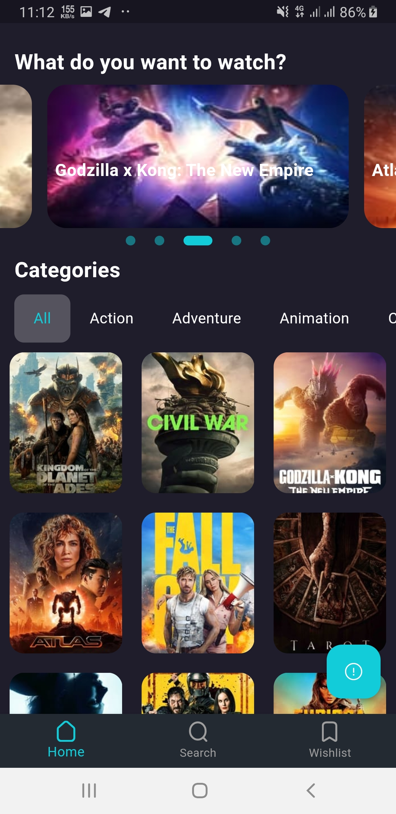

### Pray For Palestine


# MoviZone

Welcome to **MoviZone**,training project. This course is designed to help you learn and master Flutter by building a comprehensive movie application. Throughout this project, you will gain hands-on experience with Flutter development, state management, API integration, and UI design.

## Table of Contents

- [Introduction](#introduction)
- [Features](#features)
- [Installation](#installation)
- [Project Structure](#project-structure)
  - [Part 0 + Part 1: Initialization and Onboarding](https://t.me/Omar_k_flutter/196)
  - [Part 2: Home Screen and Details Screen Design](https://t.me/Omar_k_flutter/197)
  - [Part 3: Search and Wishlist Screens](https://t.me/Omar_k_flutter/198)
  - [Part 4: BLoC and API Integration - Home Screen](https://t.me/Omar_k_flutter/199)
  - [Part 5: Details Screen API Integration](https://t.me/Omar_k_flutter/201)
  - [Part 6: Advanced Search Features](https://t.me/Omar_k_flutter/202)
  - [Part 7: Wishlist Screen and Hive Integration](https://t.me/Omar_k_flutter/203)
  - [Part 8: Launcher Icon and Animations](https://t.me/Omar_k_flutter/204)
- [Screenshots](#screenshots)
- [Contributing](#contributing)
- [Contact](#contact)

## Introduction

This course will guide you through the process of developing **MoviZone**, a comprehensive movie  application, using Flutter. You'll learn how to create a feature-rich app from scratch, implementing everything from splash screens to API integration and animations.
## Screenshots

<p align="center">
  
  
</p>

<p align="center">
  
  
</p>

## Features

- User-friendly interface with intuitive navigation.
- Search functionality to find your favorite movies easily.
- Bookmark and watch later feature.

## Installation

To get a local copy up and running, follow these simple steps.

### Prerequisites

- Flutter SDK: [Installation Guide](https://flutter.dev/docs/get-started/install)
- Dart SDK (comes with Flutter)
- Android Studio or Visual Studio Code
- The Movie Database (TMDb) API: [TMDb API](https://www.themoviedb.org/)

### Clone the Repository

```bash
git clone https://github.com/yourusername/movizone.git
cd movizone
```

## Contributing

We welcome contributions! Fork the repository, make your changes, and submit a pull request. Thank you for helping us improve MoviZone!
## Contact

For any inquiries or questions regarding the MoviZone project, feel free to reach out to us via email at [dev.omar12kaialy@gmail.com](mailto:dev.omar12kaialy@gmail.com). We value your feedback and suggestions!
